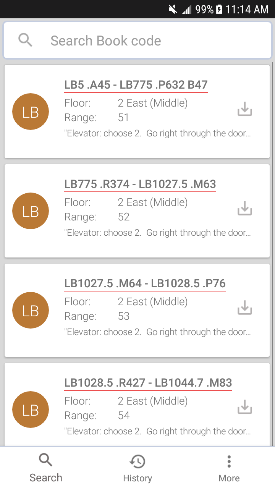
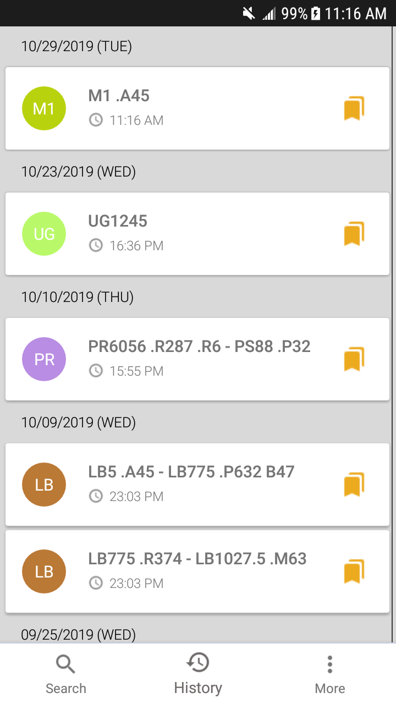
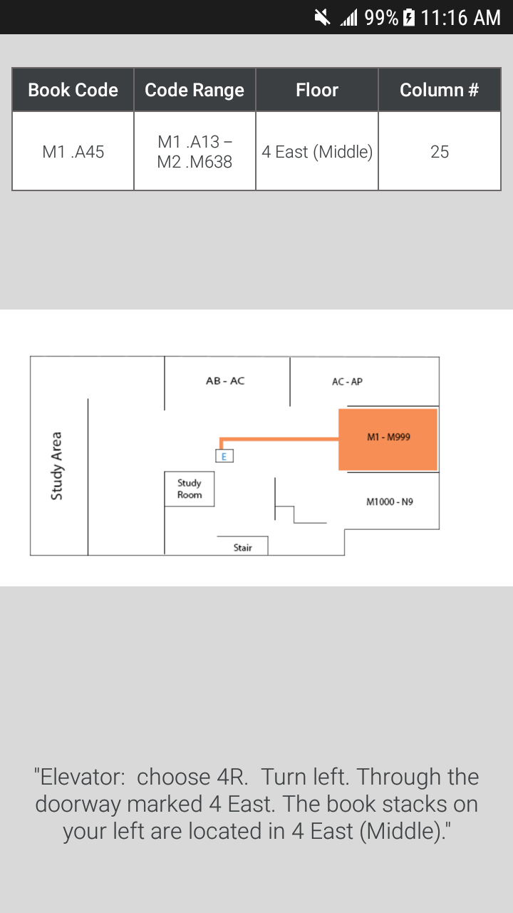
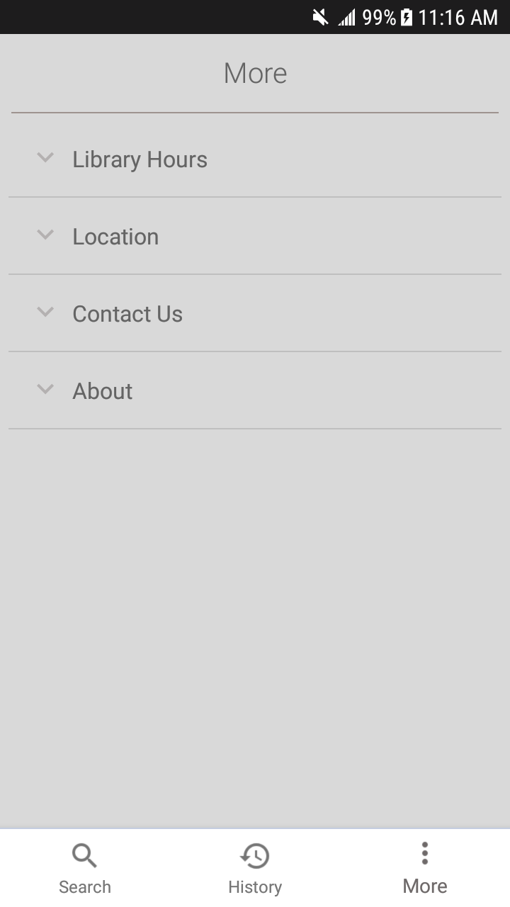
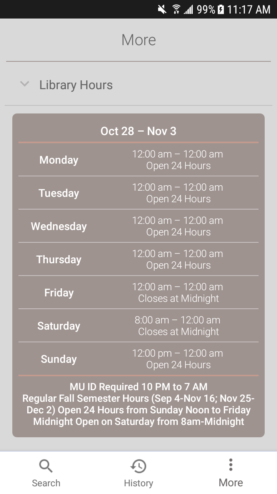
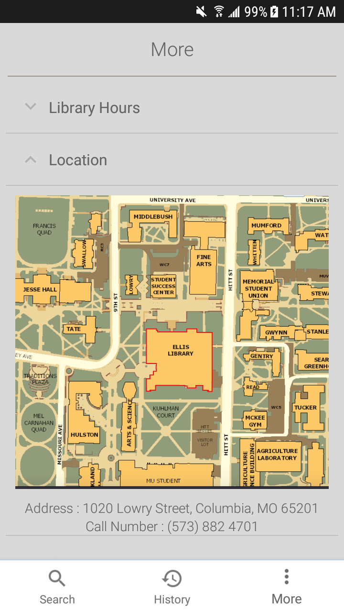

# MizzouBookSearchApp
Since Ellis library is a huge library, in the University of Missouri - Columbia, that holds millions of books with maze-like structure and complicated book code system, sometimes students are having a hard time to find a book what they are looking for.<br> <br>
This is a BookFinder App for Students that can help them find books more easily and able to save their search history. Moreover, it supports library's hours and location with contact info.<br>








## Note
All images and data that contains book's location(+ all drawable images) are not added on this repository because of security reasons and copy right.<br> <br> 
All book codes and location image displays on here are made by myself which means it is not real data and also not the images that University provided me when I started to develope this app as a IT student Assistant in Library Tech Service Team. <br> <br>
I got the data of the hours, location, and contacts of ellis library are from [Official Mizzou Library Website](http://library.missouri.edu/), some are by webscraping, some are just screenshots.

## Contents
- [Feature](#feature)
  - [Basic UI](#basic-ui)
  - [More UI](#more-ui)
  - [SQLiteDataBase](#sqlitedatabase)
  - [Search Function](#search-function)
  - [WebScraping](#webscraping)
- [Improvements](#improvements)
- [References](#references)
- [License](#license)

## Feature
  ### Basic UI<br>
  
  
  Basic UI contains with three fragment with BottomNavigationView. I used fragmentTransaction class to easily replace fragment in mobile view. Views consist of recyclerview, and each view contains book's location except in more fragment. <br> <br>
  
  ``` java
  private BottomNavigationView.OnNavigationItemSelectedListener onNavigationItemSelectedListener =
            new BottomNavigationView.OnNavigationItemSelectedListener() {

                @Override
                public boolean onNavigationItemSelected(@NonNull MenuItem menuItem) {
                    switch (menuItem.getItemId()) {
                        case R.id.navigation_search:
                            fragment = new FragmentOne_Home();
                            fragmentTransaction = getSupportFragmentManager().beginTransaction();
                            fragmentTransaction.replace(R.id.frameLayout, fragment);
                            fragmentTransaction.commit();
                            return true;
                        case R.id.navigation_history:
                            setTitle("History");
                            fragment = new FragmentTwo_His();
                            fragmentTransaction = getSupportFragmentManager().beginTransaction();
                            fragmentTransaction.replace(R.id.frameLayout, fragment);
                            fragmentTransaction.commit();
                            return true;
                        case R.id.navigation_more:
                            setTitle("More");
                            new WebScarping().execute();
                            Bundle bundle = new Bundle();
                            bundle.putSerializable("Hour", hourItem);
                            fragment = new FragmentThree_More();
                            fragment.setArguments(bundle);
                            fragmentTransaction = getSupportFragmentManager().beginTransaction();
                            fragmentTransaction.replace(R.id.frameLayout, fragment);
                            fragmentTransaction.commit();
                            return true;
                    }
                    return false;
                }
            };
  ```
  
  For history UI, since it has two parts, header(time) and data, build two viewholder, item and header, and create view depends of a boolean type variable isSection in Libdata value class.
 
 ``` java
 public class SectionedRecyclerViewAdapter extends RecyclerView.Adapter<RecyclerView.ViewHolder> {

    public static final int SEARCHDATE = 0;
    public static final int LIBDATA = 1;

    ...
    @Override
    public RecyclerView.ViewHolder onCreateViewHolder(ViewGroup parent, int typeView) {

        Context context = mContextWeakReference.get();
        if (typeView == SEARCHDATE) {
            return new SectionHeaderViewHolder(LayoutInflater.from(parent.getContext()).inflate(R.layout.section, parent, false));
        } else {
            return new SectionItemViewHolder(LayoutInflater.from(parent.getContext()).inflate(R.layout.bookcodeitem_history_recycler_view, parent, false), context);
        }
    }
    
    @Override
    public int getItemViewType(int position) {
       if (mLibdataList.get(position).isSection()) {
            return SEARCHDATE;
        } else {
            return LIBDATA;
        }
    }
 ```
  
  
  ### More UI<br>
   <br>
  Use [Third party library](https://github.com/thoughtbot/expandable-recycler-view) to implement expandable recyclerview with arrow mark. <br> <br>
  Similar steps with sectioned view in history view. Build four different view holder, hours, location, contact us, about, so that depends on view type what users touch, create different types of viewholder.
  
  ``` java
    public class MenuItemAdapter extends MultiTypeExpandableRecyclerViewAdapter<MenuViewHolder, ChildViewHolder> {
    public static final int MENUITEM_HOUR = 3;
    public static final int MENUITEM_LOCATION = 4;
    public static final int MENUITEM_CONTACTUS = 5;
    public static final int MENUITEM_UPDATEDDATE = 6;
    
    ...

    @Override
    public int getChildViewType(int position, ExpandableGroup group, int childIndex) {
        if (((Menu)group).getItems().get(childIndex).isHours()) {
            return MENUITEM_HOUR;
        } else if (((Menu)group).getItems().get(childIndex).isLocation()) {
            return MENUITEM_LOCATION;
        } else if (((Menu)group).getItems().get(childIndex).isContactUs()) {
            return MENUITEM_CONTACTUS;
        } else {
            return MENUITEM_UPDATEDDATE;
        }
    }
    
  ...

    @Override
    public ChildViewHolder onCreateChildViewHolder(ViewGroup parent, int viewType) {
        switch (viewType) {
            case MENUITEM_HOUR:
                View hours = LayoutInflater.from(parent.getContext())
                        .inflate(R.layout.expandable_recyclerview_menuinfo_hour, parent, false);
                return new MenuItemHourViewHolder(hours, parent.getContext());
            case MENUITEM_LOCATION:
                View location = LayoutInflater.from(parent.getContext())
                        .inflate(R.layout.expandable_recyclerview_menuinfo_location, parent, false);
                return new MenuItemLocationViewHolder(location);
            case MENUITEM_CONTACTUS:
                View contactUs = LayoutInflater.from(parent.getContext())
                        .inflate(R.layout.expandable_recyclerview_menuinfo_contactus, parent, false);
                return new MenuItemContactUsViewHolder(contactUs);
            case MENUITEM_UPDATEDDATE:
                View updatedDate = LayoutInflater.from(parent.getContext())
                        .inflate(R.layout.expandable_recyclerview_menuinfo_updatedate, parent, false);
                return new MenuItemUpdatedDateViewHolder(updatedDate, parent.getContext());
            default:
                throw new IllegalArgumentException("Invalid viewType");
        }
    }
    
  ...
}

  
  ```
  Also, to make image zoom in and out, I use [another library](https://github.com/davemorrissey/subsampling-scale-image-view) to make users able to see the location image more clearly.
  
  ### SQLiteDataBase<br>
  Save all the csv file which contains all books' location to local database by using sqlitedatabse<br>
  <br>*example of csv file* <br>  <br> <br>
  Build DBhelper class that creates databases that holds all csv file and holds search history. the class also contains search functions with sql query. <br> <br>
  \*creat two databases, one for store all data in csv file, and the other one is for history.
  ``` java
  @Override
    public void onCreate(SQLiteDatabase db) {
        //original tablesql
        String tableSql = "create table if not exists " + tableName + "(" +
                idColumn + " integer primary key autoincrement,  " +
                floorColumn + " text, " +
                rangeColumn + " text, " +
                beginningColumn + " text, " +
                endingColumn + " text, " +
                mapColumn + " text, " +
                textColumn + " text " +
                ")";


        String tableSql2 = "create table if not exists " + tableName2 + "(" +
                idColumn + " integer, " +
                floorColumn + " text, " +
                rangeColumn + " text, " +
                beginningColumn + " text, " +
                endingColumn + " text, " +
                mapColumn + " text, " +
                textColumn + " text, " +
                favoriteColumn + " integer default 0, " +
                currentDateAndTimeColumn + " text default '', " +
                searchTextColumn + " text default '', " +
                historyIdColumn + " integer primary key autoincrement " +
                ")";
        db.execSQL(tableSql);
        db.execSQL(tableSql2);
        // Set up Database and get all the data
        setDataBase(db);
    }
  ```
  
  \*Parse csv file and store data into database
  ``` java
  
  private void setDataBase(SQLiteDatabase db) {
        InputStream is = context.getResources().openRawResource(R.raw.data);
        BufferedReader reader = new BufferedReader(
                new InputStreamReader(is, Charset.forName("UTF-8"))
        );
        String line;
        db.beginTransaction();
        try {
            while ((line = reader.readLine()) != null) {
                String[] colums = line.split(",");
                if (colums.length != 6) {
                    Log.d("CSVParser", "Skipping Bad CSV Row");
                    continue;
                }
                ContentValues cv = new ContentValues(3);
                cv.put(floorColumn, colums[0].trim());
                cv.put(rangeColumn, colums[1].trim());
                cv.put(beginningColumn, colums[2].trim());
                cv.put(endingColumn, colums[3].trim());
                cv.put(mapColumn, colums[4].trim());
                cv.put(textColumn, colums[5].trim());
                db.insert(tableName, null, cv);
            }
        } catch (IOException e) {
            e.printStackTrace();
        }
        db.setTransactionSuccessful();
        db.endTransaction();

    }
    
  ```
  
  ### Search Function<br>
  Search and Touch Event <br>
   <br>
  Search and Save history <br>
   <br>

  ### WebScraping<br>
  Explain Here<br>
   <br>
### Improvements
1. Data Normalization
2. Server Database

### References

### License
This app is a portfolio app for educational purposes
