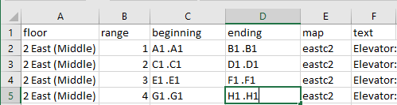
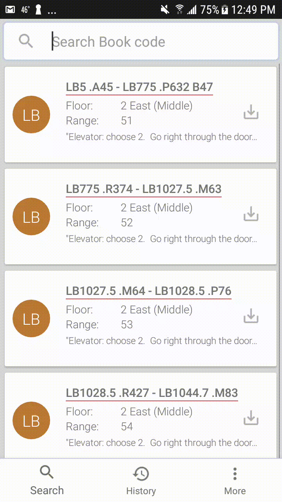
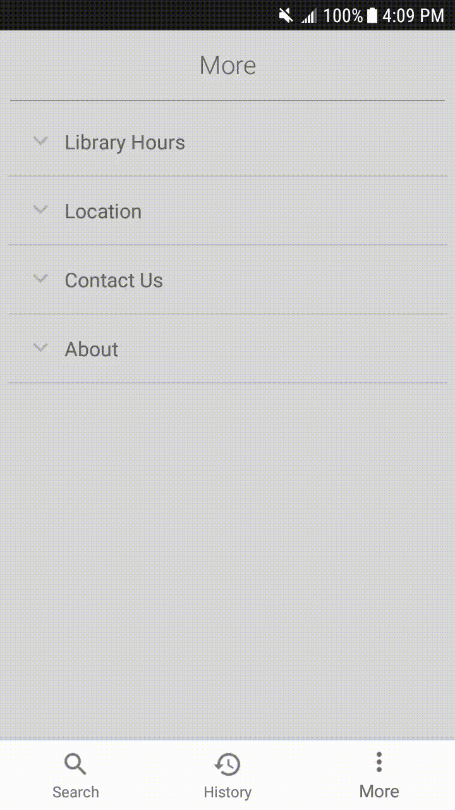

# (Portflio) MizzouBookSearchApp
Since Ellis Library is a huge library, in the University of Missouri - Columbia, that holds millions books with maze-like structure, sometimes students are having a hard time to find a book what they are looking for. 
This is a BookFinder App for Students that can help them find books more easily and able to save their search history.

## Note

## Contents
- [Feature](#feature)
  - [Basic UI](#basic ui)
  - [More UI](#more ui)
  - [SQLiteDataBase](#sqlitedatabase)
  - [Search Function](#search function)
  - [WebScraping](#webscraping)
- [Improvements](#improvements)
- [Support](#support)
- [License](#license)

## Feature
  ### Basic UI 
  Explain Here 
    
  ### More UI 
  Explain Here 
    

  ### SQLiteDataBase 
  Save all the csv file which contains all books' location to local database by using sqlitedatabse 
   *example of csv file*     
  ### Search Function 
    - Search and Touch Event  
      
    - Search and Save history  
      

  ### WebScraping 
  Explain Here 
    
### Improvements

### Support

### License
This app is a portfolio app for educational purposes
